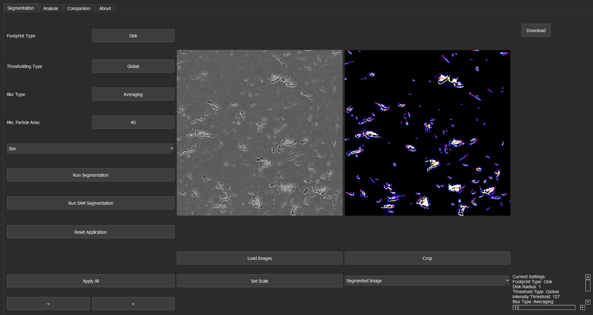
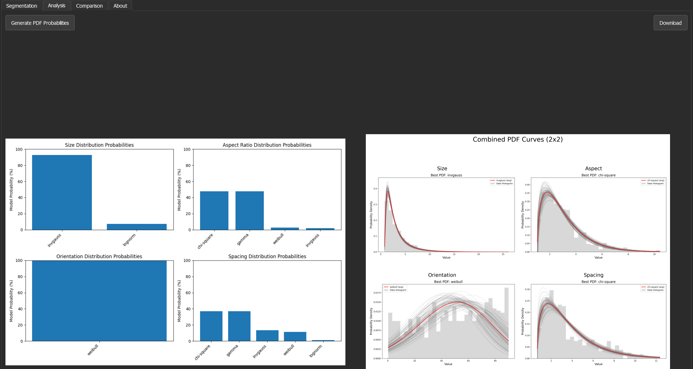
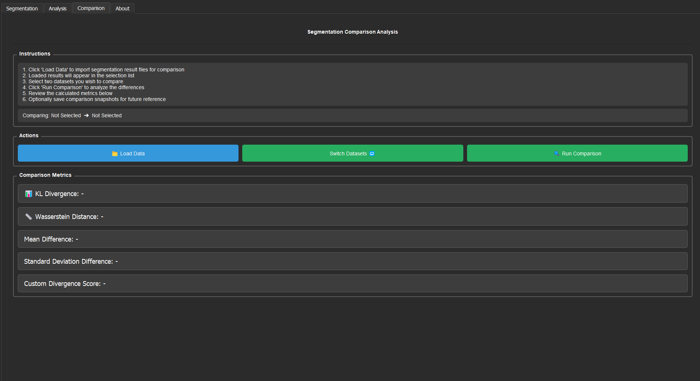

# SEM Analysis Tool

*This project was created by Nelson Goosman, Kenan Anderson, and Nicholas Lopez as part of the spring/fall 2025 capstone project for Dr. Arezoo Zare at Washington State University*

## Overview

The **SEM Analysis Tool** is a specialized software application designed for the analysis of Scanning Electron Microscope (SEM) images. It provides a robust workflow for researchers and analysts to process images, extract quantitative data, and perform statistical modeling.

The application leverages morphological operations to determine critical metrics such as particle size, spacing, and aspect ratio. It features a dynamic Probability Distribution Function (PDF) fitting engine that tests various distributions to find the best fit for the data. Users can generate, visualize, and compare PDFs to identify similarities and trends across different samples.

## Features

-   **Image Processing**: Upload and process various SEM image formats.
-   **Advanced Segmentation**: Select from multiple segmentation algorithms to accurately isolate features.
-   **Morphological Analysis**: Automatically extract data on:
    -   Size
    -   Spacing
    -   Aspect Ratio
-   **Statistical Analysis**:
    -   Dynamic fitting of Probability Distribution Functions (PDFs).
    -   Generation of best-fit average distributions.
-   **Data Comparison**: Tools to compare multiple PDFs and analyze dataset similarities.

## Screenshots

### Segmentation

*Advanced segmentation options to isolate features.*

### Analysis

*Morphological and statistical analysis of extracted data.*

### Comparison

*Comparison of Probability Distribution Functions (PDFs).*

## Prerequisites

Ensure the following are installed on your system:

-   **Python** (3.x recommended)
-   **pip** (Python Package Installer)
-   **Git**

To verify your installation, run the following commands in your terminal:

```bash
python --version
pip --version
git --version
```

If any of these are missing, please refer to the official installation guides:
-   [Python](https://wiki.python.org/moin/BeginnersGuide/Download)
-   [Git](https://git-scm.com/book/en/v2/Getting-Started-Installing-Git)
-   [pip](https://pip.pypa.io/en/stable/cli/pip_download/)

## Installation

1.  **Clone the Repository**

    ```bash
    git clone https://github.com/NelsonGoosman/SEM-Analysis-Tool.git
    cd SEM-Analysis-Tool
    ```

2.  **Set Up the Environment**

    You can use the provided setup script or set up the environment manually.

    **Option A: Automatic Setup**
    ```bash
    python ./help/setup.py
    ```

    **Option B: Manual Setup**
    If the automatic setup fails, create and activate the virtual environment manually:

    *Create virtual environment:*
    ```bash
    python -m venv sem_venv
    ```

    *Activate virtual environment:*
    -   **Windows:**
        ```powershell
        .\sem_venv\Scripts\Activate
        ```
    -   **MacOS/Linux:**
        ```bash
        source ./sem_venv/bin/activate
        ```

    *Install Dependencies:*
    ```bash
    pip install -r requirements.txt
    ```

## Usage

To launch the application, ensure your virtual environment is active and run:

```bash
python ./src/app/main.py
```

## License

**MIT License**

Copyright (c) 2025 Dr. Arezoo Zare

Permission is hereby granted, free of charge, to any person obtaining a copy of this software and associated documentation files (the "Software"), to deal in the Software without restriction, including without limitation the rights to use, copy, modify, merge, publish, distribute, sublicense, and/or sell copies of the Software, and to permit persons to whom the Software is furnished to do so, subject to the following conditions:

The above copyright notice and this permission notice shall be included in all copies or substantial portions of the Software.

THE SOFTWARE IS PROVIDED "AS IS", WITHOUT WARRANTY OF ANY KIND, EXPRESS OR IMPLIED, INCLUDING BUT NOT LIMITED TO THE WARRANTIES OF MERCHANTABILITY, FITNESS FOR A PARTICULAR PURPOSE AND NONINFRINGEMENT. IN NO EVENT SHALL THE AUTHORS OR COPYRIGHT HOLDERS BE LIABLE FOR ANY CLAIM, DAMAGES OR OTHER LIABILITY, WHETHER IN AN ACTION OF CONTRACT, TORT OR OTHERWISE, ARISING FROM, OUT OF OR IN CONNECTION WITH THE SOFTWARE OR THE USE OR OTHER DEALINGS IN THE SOFTWARE.

